# ddcherryx 数据库结构分析报告

## 概述

该数据库是一个基于 **RuoYi-Vue-Plus** 框架的多租户后台管理系统，包含 **28 张数据表**，涵盖用户权限管理、组织架构、产品管理、系统配置等核心业务模块。

---

## 第一部分：关系分析

### 1. 核心实体表

| 序号 | 表名 | 中文名称 | 说明 |
|:---:|------|----------|------|
| 1 | `sys_user` | 用户信息表 | 系统用户核心表 |
| 2 | `sys_role` | 角色信息表 | 角色权限定义 |
| 3 | `sys_menu` | 菜单权限表 | 系统菜单与权限 |
| 4 | `sys_dept` | 部门表 | 组织架构（树形） |
| 5 | `sys_post` | 岗位信息表 | 岗位定义 |
| 6 | `sys_tenant` | 租户表 | 多租户管理 |
| 7 | `sys_tenant_package` | 租户套餐表 | 租户功能套餐 |
| 8 | `sys_product` | 商品信息表 | 产品主表 |
| 9 | `sys_product_detail` | 商品明细表 | 产品明细/SKU |
| 10 | `sys_category` | 产品类别表 | 产品分类 |
| 11 | `sys_dict_type` | 字典类型表 | 数据字典类型 |
| 12 | `sys_dict_data` | 字典数据表 | 数据字典值 |
| 13 | `sys_config` | 参数配置表 | 系统参数配置 |
| 14 | `sys_client` | 系统授权表 | OAuth客户端配置 |
| 15 | `sys_oss` | OSS对象存储表 | 文件存储记录 |
| 16 | `sys_oss_config` | 对象存储配置表 | OSS配置信息 |
| 17 | `sys_notice` | 通知公告表 | 系统公告 |
| 18 | `sys_oper_log` | 操作日志记录 | 操作审计日志 |
| 19 | `sys_logininfor` | 系统访问记录 | 登录日志 |
| 20 | `sys_social` | 社会化关系表 | 第三方登录绑定 |
| 21 | `gen_table` | 代码生成业务表 | 代码生成器配置 |
| 22 | `gen_table_column` | 代码生成字段表 | 代码生成字段配置 |
| 23 | `test_demo` | 测试单表 | 演示数据 |
| 24 | `test_tree` | 测试树表 | 演示树形数据 |

### 2. 关联表（中间表）

| 序号 | 表名 | 中文名称 | 关联关系 |
|:---:|------|----------|----------|
| 1 | `sys_user_role` | 用户角色关联表 | 用户 ↔ 角色 (多对多) |
| 2 | `sys_user_post` | 用户岗位关联表 | 用户 ↔ 岗位 (多对多) |
| 3 | `sys_role_menu` | 角色菜单关联表 | 角色 ↔ 菜单 (多对多) |
| 4 | `sys_role_dept` | 角色部门关联表 | 角色 ↔ 部门 (多对多) |

---

### 3. 表间关系详细分析

#### 3.1 用户权限管理模块

| 主表 | 关联表 | 关联字段 | 关系类型 | 业务描述 |
|------|--------|----------|:--------:|----------|
| `sys_user` | `sys_dept` | `sys_user.dept_id` → `sys_dept.dept_id` | 多对一 | 用户归属于某个部门 |
| `sys_user` | `sys_tenant` | `sys_user.tenant_id` → `sys_tenant.tenant_id` | 多对一 | 用户归属于某个租户 |
| `sys_user` | `sys_role` | 通过 `sys_user_role` 中间表 | 多对多 | 用户可拥有多个角色 |
| `sys_user` | `sys_post` | 通过 `sys_user_post` 中间表 | 多对多 | 用户可担任多个岗位 |
| `sys_role` | `sys_menu` | 通过 `sys_role_menu` 中间表 | 多对多 | 角色可拥有多个菜单权限 |
| `sys_role` | `sys_dept` | 通过 `sys_role_dept` 中间表 | 多对多 | 角色可关联多个部门（数据权限） |
| `sys_social` | `sys_user` | `sys_social.user_id` → `sys_user.user_id` | 多对一 | 用户可绑定多个社交账号 |

#### 3.2 组织架构模块

| 主表 | 关联表 | 关联字段 | 关系类型 | 业务描述 |
|------|--------|----------|:--------:|----------|
| `sys_dept` | `sys_dept` | `sys_dept.parent_id` → `sys_dept.dept_id` | 自关联 | 部门树形结构（父子关系） |
| `sys_dept` | `sys_tenant` | `sys_dept.tenant_id` → `sys_tenant.tenant_id` | 多对一 | 部门归属于某个租户 |
| `sys_post` | `sys_dept` | `sys_post.dept_id` → `sys_dept.dept_id` | 多对一 | 岗位归属于某个部门 |
| `sys_post` | `sys_tenant` | `sys_post.tenant_id` → `sys_tenant.tenant_id` | 多对一 | 岗位归属于某个租户 |

#### 3.3 菜单权限模块

| 主表 | 关联表 | 关联字段 | 关系类型 | 业务描述 |
|------|--------|----------|:--------:|----------|
| `sys_menu` | `sys_menu` | `sys_menu.parent_id` → `sys_menu.menu_id` | 自关联 | 菜单树形结构（父子关系） |

#### 3.4 租户管理模块

| 主表 | 关联表 | 关联字段 | 关系类型 | 业务描述 |
|------|--------|----------|:--------:|----------|
| `sys_tenant` | `sys_tenant_package` | `sys_tenant.package_id` → `sys_tenant_package.package_id` | 多对一 | 租户使用某个功能套餐 |

#### 3.5 产品管理模块

| 主表 | 关联表 | 关联字段 | 关系类型 | 业务描述 |
|------|--------|----------|:--------:|----------|
| `sys_product` | `sys_category` | `sys_product.category_id` → `sys_category.category_id` | 多对一 | 产品归属于某个类别 |
| `sys_product` | `sys_oss` | `sys_product.oss_id` → `sys_oss.oss_id` | 多对一 | 产品关联图片文件 |
| `sys_product` | `sys_dept` | `sys_product.dept_id` → `sys_dept.dept_id` | 多对一 | 产品归属于某个部门 |
| `sys_product_detail` | `sys_product` | `sys_product_detail.product_id` → `sys_product.product_id` | 多对一 | 产品包含多个明细/SKU |
| `sys_category` | `sys_dept` | `sys_category.dept_id` → `sys_dept.dept_id` | 多对一 | 类别归属于某个部门 |

#### 3.6 字典配置模块

| 主表 | 关联表 | 关联字段 | 关系类型 | 业务描述 |
|------|--------|----------|:--------:|----------|
| `sys_dict_data` | `sys_dict_type` | `sys_dict_data.dict_type` → `sys_dict_type.dict_type` | 多对一 | 字典数据归属于字典类型 |

#### 3.7 代码生成模块

| 主表 | 关联表 | 关联字段 | 关系类型 | 业务描述 |
|------|--------|----------|:--------:|----------|
| `gen_table_column` | `gen_table` | `gen_table_column.table_id` → `gen_table.table_id` | 多对一 | 表包含多个字段定义 |

#### 3.8 测试演示模块

| 主表 | 关联表 | 关联字段 | 关系类型 | 业务描述 |
|------|--------|----------|:--------:|----------|
| `test_demo` | `sys_dept` | `test_demo.dept_id` → `sys_dept.dept_id` | 多对一 | 测试数据关联部门 |
| `test_demo` | `sys_user` | `test_demo.user_id` → `sys_user.user_id` | 多对一 | 测试数据关联用户 |
| `test_tree` | `sys_dept` | `test_tree.dept_id` → `sys_dept.dept_id` | 多对一 | 测试树关联部门 |
| `test_tree` | `sys_user` | `test_tree.user_id` → `sys_user.user_id` | 多对一 | 测试树关联用户 |
| `test_tree` | `test_tree` | `test_tree.parent_id` → `test_tree.id` | 自关联 | 测试树形结构 |

---

## 第二部分：实体关系图 (ER Diagram)

```mermaid
erDiagram
    %% ==================== 租户管理 ====================
    sys_tenant ||--o{ sys_user : "拥有"
    sys_tenant ||--o{ sys_dept : "拥有"
    sys_tenant ||--o{ sys_role : "拥有"
    sys_tenant ||--o{ sys_post : "拥有"
    sys_tenant ||--o{ sys_category : "拥有"
    sys_tenant ||--o{ sys_config : "拥有"
    sys_tenant }o--|| sys_tenant_package : "使用套餐"
    
    sys_tenant {
        bigint id PK
        varchar tenant_id UK "租户编号"
        varchar company_name "企业名称"
        bigint package_id FK "套餐ID"
        char status "状态"
    }
    
    sys_tenant_package {
        bigint package_id PK
        varchar package_name "套餐名称"
        varchar menu_ids "关联菜单"
        char status "状态"
    }
    
    %% ==================== 用户权限管理 ====================
    sys_user }o--|| sys_dept : "归属部门"
    sys_user ||--o{ sys_social : "绑定社交账号"
    sys_user }o--o{ sys_role : "拥有角色"
    sys_user }o--o{ sys_post : "担任岗位"
    
    sys_user {
        bigint user_id PK
        varchar tenant_id FK "租户ID"
        bigint dept_id FK "部门ID"
        varchar user_name "用户名"
        varchar nick_name "昵称"
        varchar password "密码"
        char status "状态"
    }
    
    sys_role ||--o{ sys_role_menu : "分配菜单"
    sys_role ||--o{ sys_role_dept : "数据权限"
    
    sys_role {
        bigint role_id PK
        varchar tenant_id FK "租户ID"
        varchar role_name "角色名"
        varchar role_key "角色标识"
        char data_scope "数据范围"
        char status "状态"
    }
    
    sys_social {
        bigint id PK
        bigint user_id FK "用户ID"
        varchar source "来源平台"
        varchar open_id "平台用户ID"
        varchar access_token "令牌"
    }
    
    %% ==================== 中间关联表 ====================
    sys_user_role {
        bigint user_id PK,FK
        bigint role_id PK,FK
    }
    
    sys_user_post {
        bigint user_id PK,FK
        bigint post_id PK,FK
    }
    
    sys_role_menu {
        bigint role_id PK,FK
        bigint menu_id PK,FK
    }
    
    sys_role_dept {
        bigint role_id PK,FK
        bigint dept_id PK,FK
    }
    
    %% ==================== 组织架构 ====================
    sys_dept ||--o{ sys_dept : "上下级"
    sys_dept ||--o{ sys_post : "包含岗位"
    sys_dept ||--o{ sys_category : "管理类别"
    
    sys_dept {
        bigint dept_id PK
        varchar tenant_id FK "租户ID"
        bigint parent_id FK "父部门ID"
        varchar dept_name "部门名称"
        bigint leader FK "负责人"
        char status "状态"
    }
    
    sys_post {
        bigint post_id PK
        varchar tenant_id FK "租户ID"
        bigint dept_id FK "部门ID"
        varchar post_code "岗位编码"
        varchar post_name "岗位名称"
        char status "状态"
    }
    
    %% ==================== 菜单权限 ====================
    sys_menu ||--o{ sys_menu : "父子菜单"
    sys_menu ||--o{ sys_role_menu : "分配给角色"
    
    sys_menu {
        bigint menu_id PK
        varchar menu_name "菜单名称"
        bigint parent_id FK "父菜单ID"
        char menu_type "类型(M/C/F)"
        varchar perms "权限标识"
        char status "状态"
    }
    
    %% ==================== 产品管理 ====================
    sys_category ||--o{ sys_product : "包含产品"
    sys_product ||--o{ sys_product_detail : "包含明细"
    sys_product }o--o| sys_oss : "关联图片"
    
    sys_category {
        bigint category_id PK
        varchar tenant_id FK "租户ID"
        bigint dept_id FK "部门ID"
        varchar category_code "类别编码"
        varchar category_name "类别名称"
        char status "状态"
    }
    
    sys_product {
        bigint product_id PK
        bigint category_id FK "类别ID"
        bigint oss_id FK "图片ID"
        bigint dept_id FK "部门ID"
        varchar product_code "商品编码"
        varchar product_name "商品名称"
        char status "状态"
    }
    
    sys_product_detail {
        bigint detail_id PK
        bigint product_id FK "产品ID"
        varchar unique_code "唯一标识码"
        int num "验证次数"
        char status "状态"
    }
    
    %% ==================== 系统配置 ====================
    sys_dict_type ||--o{ sys_dict_data : "包含字典值"
    
    sys_dict_type {
        bigint dict_id PK
        varchar tenant_id FK "租户ID"
        varchar dict_name "字典名称"
        varchar dict_type UK "字典类型"
    }
    
    sys_dict_data {
        bigint dict_code PK
        varchar tenant_id FK "租户ID"
        varchar dict_type FK "字典类型"
        varchar dict_label "字典标签"
        varchar dict_value "字典键值"
    }
    
    sys_config {
        bigint config_id PK
        varchar tenant_id FK "租户ID"
        varchar config_name "参数名称"
        varchar config_key UK "参数键名"
        varchar config_value "参数键值"
    }
    
    %% ==================== 文件存储 ====================
    sys_oss {
        bigint oss_id PK
        varchar tenant_id FK "租户ID"
        varchar file_name "文件名"
        varchar original_name "原文件名"
        varchar url "访问地址"
        varchar service "服务商"
    }
    
    sys_oss_config {
        bigint oss_config_id PK
        varchar tenant_id FK "租户ID"
        varchar config_key "配置key"
        varchar bucket_name "桶名称"
        varchar endpoint "访问站点"
        char status "是否默认"
    }
    
    %% ==================== 系统日志 ====================
    sys_logininfor {
        bigint info_id PK
        varchar tenant_id FK "租户ID"
        varchar user_name "用户账号"
        varchar ipaddr "登录IP"
        char status "登录状态"
        datetime login_time "登录时间"
    }
    
    sys_oper_log {
        bigint oper_id PK
        varchar tenant_id FK "租户ID"
        varchar title "模块标题"
        int business_type "业务类型"
        varchar oper_name "操作人员"
        int status "操作状态"
    }
    
    %% ==================== 代码生成 ====================
    gen_table ||--o{ gen_table_column : "包含字段"
    
    gen_table {
        bigint table_id PK
        varchar table_name "表名称"
        varchar table_comment "表描述"
        varchar class_name "实体类名"
    }
    
    gen_table_column {
        bigint column_id PK
        bigint table_id FK "表ID"
        varchar column_name "列名称"
        varchar column_type "列类型"
        varchar java_type "JAVA类型"
    }
    
    %% ==================== 其他 ====================
    sys_client {
        bigint id PK
        varchar client_id "客户端ID"
        varchar client_key "客户端key"
        varchar grant_type "授权类型"
        char status "状态"
    }
    
    sys_notice {
        bigint notice_id PK
        varchar tenant_id FK "租户ID"
        varchar notice_title "公告标题"
        char notice_type "公告类型"
        char status "状态"
    }
```

---

## 第三部分：关系总结

### 关系类型统计

| 关系类型 | 数量 | 说明 |
|:--------:|:----:|------|
| 一对多 | 18 | 主要是主表与从表的关系 |
| 多对多 | 4 | 通过中间表实现（用户-角色、用户-岗位、角色-菜单、角色-部门） |
| 自关联 | 3 | 树形结构（部门、菜单、测试树） |

### 核心业务关系链

1. **权限控制链**: `租户` → `用户` → `角色` → `菜单/权限`
2. **组织架构链**: `租户` → `部门(树形)` → `岗位` → `用户`
3. **产品管理链**: `类别` → `产品` → `产品明细`
4. **数据字典链**: `字典类型` → `字典数据`

### 多租户设计特点

- 大多数业务表都包含 `tenant_id` 字段，实现租户数据隔离
- 租户可关联套餐 (`sys_tenant_package`)，控制可用功能
- 支持租户级别的配置 (`sys_config`)、字典 (`sys_dict_type/data`) 等
